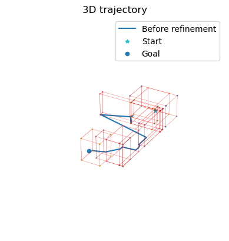
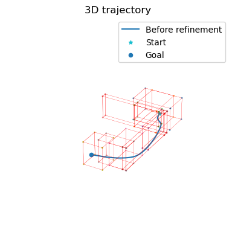
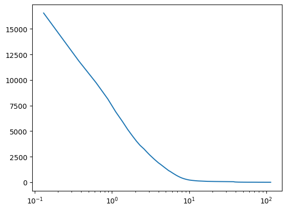

## Read me
The file Cournot-Planner shows the result of trajectory planning with our Cournot Planner.
Here are the visualization of result.
### Initial trajectory

### Optimal trajectory

### Loss

